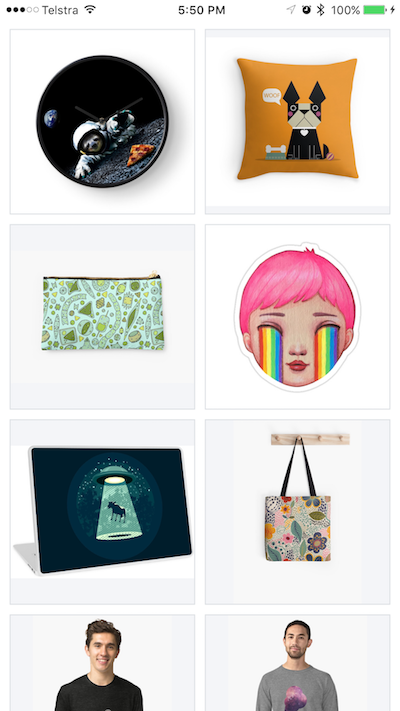

# Redbubble iOS Homework Task

Hello! Welcome to our homework task.

This task should only take you a couple of hours all together so please don't spend too much time on it. If you have any questions, feel free to ask or make any assumptions you like as long as you document and have a good reason for them.

Good luck and we look forward to seeing your solution!


## The Task

Clone this template project. It is written in Swift 3 so please continue using Swift and Xcode 8. Also use storyboards as much as is convenient and try to avoid using any other third party libraries. Assume that you will only have to support iPhones for now.

#### Step 1

This project contains a database with Artworks & Products. Display these Products and Artworks as shown below.




#### Step 2

Extend the project to allow users to favourite any Product or Artwork.

We want:

* these favourites to persist between sessions
* to be able to filter viewing favourited, not favourited, and all items together. This can be done using any UI pattern you wish! Check out the Asset Catalog for some icons you might like to use.


#### Brownie points
Too easy? Or just having the time of your life and want to keep going? Try one of the below for some brownie points:

* nice transitions/animations
* filter by a search term
* randomise the Products & Artworks so that you get a nicer integrated view instead of having a block of Products, followed by a block of Artworks

## Expectations

We are looking for production ready code. This means we will be looking for all the usual programming best practises:

* thoughtful architecture
* tests
* documentation
* code style and readability
* no warnings or errors

This also means we will looking to end up with a working app and dare I say, even a delightful one!


## Setup

This project uses Realm which is integrated into our project using [CocoaPods](https://cocoapods.org/about). If you don't have CocoaPods installed please do so by following the guide [here](https://guides.cocoapods.org/using/getting-started.html). 

Once you have CocoaPods installed run the following:

```swift
pod install
```

Then open up the .xcworkspace (as opposed to the .xcodeproj) in Xcode and you're good to go!


## Get Started

We know you can google, so to get you started here is some code to help you query our database straight away:


```swift
import RealmSwift

let realm = try! Realm()
let products = realm.objects(RSProduct.self)
for product in products {
   // Do whatever you need with products
}
```

We have also included a bunch of icons you might like to use in the Asset Catalog so take a look at those.


